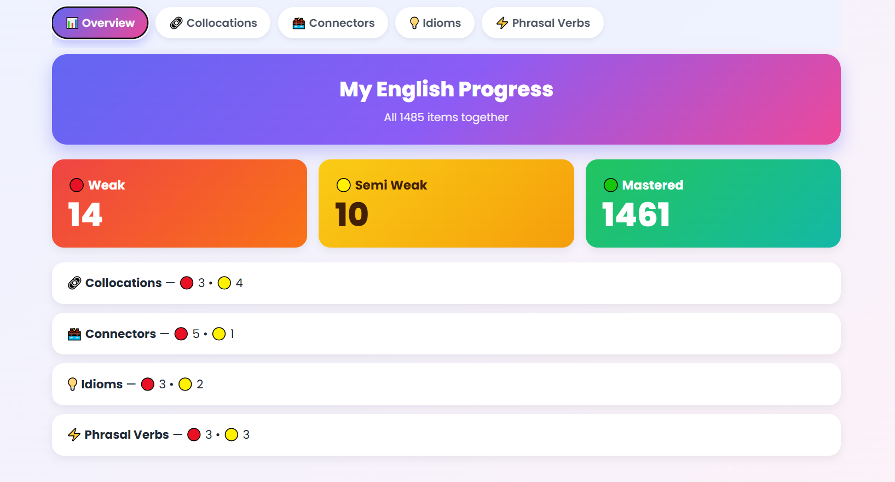
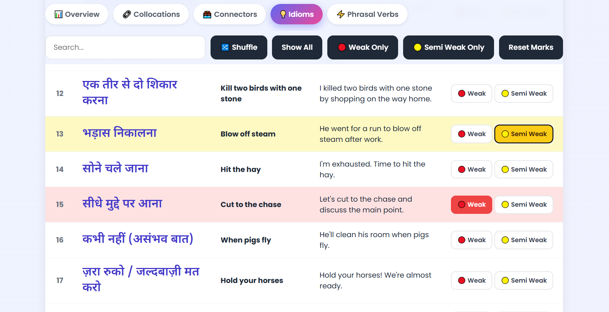

# 📚 Lexora — English Learning Dashboard

Lexora is a React-based English learning dashboard that helps learners organize and track their progress in English collocations, connectors, idioms, and phrasal verbs. It provides an interactive interface for marking learning levels, searching expressions, and monitoring progress.

## ✨ Features

* 📊 **Progress Dashboard** — View Weak, Semi-Weak, and Mastered item counts.
* 📚 **Four Learning Categories** — Collocations, Connectors, Idioms, and Phrasal Verbs.
* 🔍 **Live Search** — Search expressions by Hindi meaning, English phrase, or example sentence.
* 🎯 **Learning Status Tracking** — Mark expressions as Weak or Semi-Weak.
* 🔄 **Shuffle Words** — Display expressions in a randomized order.
* 🎛️ **Status Filtering** — Filter expressions by learning status.
* 💾 **LocalStorage Persistence** — Keep learning progress after refreshing the browser.
* 📱 **Responsive Interface** — Designed for convenient use across screen sizes.

## 🛠️ Tech Stack

* React
* JavaScript (ES6+)
* CSS3
* LocalStorage
* Create React App / React Scripts

## 🚀 Getting Started

### Prerequisites

* Node.js
* npm

### Installation

1. Clone the repository:

   ```bash
   git clone https://github.com/piyushdhakad001/lexora-english-learning-dashboard
   ```

2. Open the project folder:

   ```bash
   cd lexora-english-learning-dashboard
   ```

3. Install dependencies:

   ```bash
   npm install
   ```

4. Start the development server:

   ```bash
   npm run dev
   ```

5. Open the local URL shown in your terminal, usually `http://localhost:5173`.

## 📂 Project Structure

```text
src/
├── components/
│   ├── Tabs.jsx
│   ├── Overview.jsx
│   ├── Toolbar.jsx
│   └── WordTable.jsx
├── data/
│   └── words.js
├── utils/
│   └── helpers.js
├── App.jsx
├── App.css
└── index.js
```

## 💡 How It Works

1. Select a learning category from the navigation tabs.
2. Search for expressions using Hindi meanings, English phrases, or examples.
3. Mark expressions as Weak or Semi-Weak according to your learning needs.
4. Use filters to focus on expressions that need more practice.
5. Shuffle the word list for a different learning order.
6. Visit the overview dashboard to monitor your learning progress.

Your marks are saved in the browser using LocalStorage, so they remain available after a page refresh on the same browser.

## 🖼️ Screenshots

### Dashboard


### Learning Page



## 🌐 Live Demo

[View Live Demo](https://lexora-english-learning-dashboard.vercel.app/)

## 🎯 Project Goal

Lexora was built to practice React development, component-based architecture, state management, dynamic rendering, search and filtering, and browser-based data persistence.

## 👨‍💻 Author

**Piyush Dhakad**

* GitHub: [Piyush Dhakad](https://github.com/piyushdhakad001)

---
